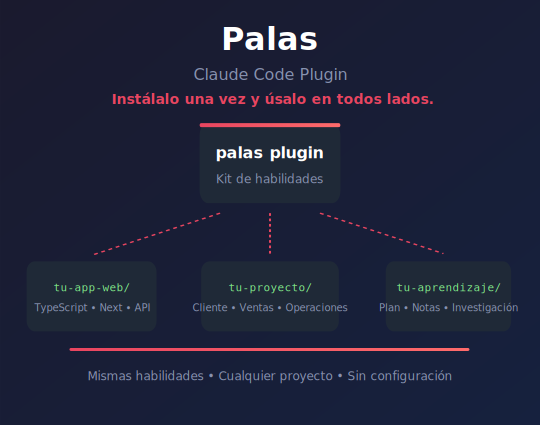

# Palas — Marketplace de Plugins para Claude Code



<br/>

En este repositorio encontrarás varios **Plugins con Skills (Habilidades) de Claude Code** que te serán **útiles a tí y a tu negocio**. Hemos empezado con un par, pero el objetivo es ir añadiendo más, con foco en mejorar la **productividad personal y la especializada en negocio** y poder ayudar también a las PYMES a dar sus primeros pasos con la IA Agéntica.

Mientras la mayoría de plugins se centran en el desarrollo de software, "agentic-ai-palas" nace para ayudar a todos: rendimiento personal, la gestión de datos, operaciones, finanzas, marketing, etc.

## Conceptos clave

Si es tu primera vez usando una herramienta de este tipo, aquí tienes lo básico para entender el potencial:

* 🤖 **IA Agéntica:** A diferencia de un chat normal (que solo "habla"), una IA agéntica puede **actuar**. Tiene "manos": puede leer tus archivos, ejecutar comandos, realizar cálculos y tomar decisiones para completar tareas complejas de forma autónoma.
* 🧩 **Plugins:** Es una forma de empaquetar Skills para facilitar su consumo. En vez de tener que preocuparte de copiar/pegar Skills que veas por ahí, Claude facilita su consumo a través del concepto de "Plugin".
* 🛠️ **Skills (Habilidades):** Es la chicha principal. Un Skill es una habilidad dedicada a hacer algo concreto, una tarea específica que añades y le da un nuevo "superpoder" a Claude. Siempre puedes crear o copiar Skills en un proyecto sin necesidad de Plugins, la ventaja que tienen es que es más cómodo de gestionar.

Los Plugins son como cajas de herramientas, te los bajas de internet y no te ocupan espacio en tu repo (las skills se instalan en la zona de cache global de Claude). Puede coger el skill que necesites, coger el martillo, la calculadora o el gestor concreto en cada proyecto.

## ¿Empezando con Claude?

Si estás empezando desde cero y ni siquiera tienes el fichero `CLAUDE.md` ni el directorio `.claude` en tu proyecto, te recomiendo que sigas este mini-tutorial para romper el hielo:

```bash
# Abre una terminal y navega a tu proyecto
mkdir -p mi-proyecto
cd mi-proyecto

# Crea la configuración mínima
# Usuarios de Windows: Ejecutar desde Git Bash, no PowerShell o CMD.
curl -fsSL https://raw.githubusercontent.com/Jacopalas/agentic-ai-palas/main/starter/minimal-install.sh | bash
```

Se creará una carpeta `.claude/` con un archivo `CLAUDE.md`. Contiene unas instrucciones básicas para Claude, para que te sirva de ejemplo y deja un pequeño spacio donde añadir notas específicas de tu proyecto.

Piensa en `CLAUDE.md` como el "briefing" que le das a Claude cada vez que abre tu proyecto. Cuanto más contexto le des, mejor te ayudará.

## Instalación de uno o más plugins "Palas"

Primero sitúate en el proyecto en el que vas a trabajar:

* Por línea de comando, abre un terminal y navega a tu proyecto (un ejemplo)
  * `cd mi-proyecto` y ejecuta `claude`
* Desde VS Code, Cursor, etc.
  * Abre tu proyecto en el IDE
  * Asegúrate de tener instalada la Extensión de Claude
  * Abre el panel de Claude Code (normalmente en la barra lateral)
  * Claude ya estará en el contexto de tu proyecto

El siguiente paso es instalar el Marketplace `agentic-ai-palas` y después instalar el plugin que quieras.

* **En modo GUI**:
  * Escribe `/plugin` y entra en Manage Plugins.
  * En la lengüeta `Marketplaces` añade `Jacopalas/agentic-ai-palas`.
  * En la lengüeta `Plugins` selecciona "palas-basic" y dale a Install
* **En modo comando**:
  * Añadir el marketplace (una sola vez): `/plugin marketplace add Jacopalas/agentic-ai-palas`
  * Instalar el plugin que quieras, ejemplo: `/plugin install palas-basic@agentic-ai-palas`

## Plugins disponibles

| Plugin | Habilidades | Descripción |
|--------|-------------|-------------|
| **palas-basic** | `fixing-markdown`, `removing-notebooklm` | Herramientas comunes: formato markdown y eliminación de watermarks |
| **palas-git** | `commit` | Commits bien estructurados con Conventional Commits |
| **palas-security** | `security-scan` | Escaneo de secretos y vulnerabilidades |

## Estructura de un plugin

Cada plugin sigue una estructura estándar:

```text
palas-<nombre>/
├── .claude-plugin/
│   └── plugin.json      # Metadatos del plugin (requerido)
├── .mcp.json            # Configuración MCP (opcional)
├── commands/            # Comandos slash (opcional)
├── skills/              # Habilidades (opcional)
└── README.md            # Documentación
```

## Requisitos

Algunos plugins tienen scripts que dependen de herramientas JavaScript CLI o librerías Python. Usamos **gestión de dependencias sin huella** (zero-footprint):

* **Python**: Vas a tener que instalar tanto `Python` como el programa `uv`
* **JavaScript**: Vas a tener que instalar tanto `NodeJS` como `pnpm`

Para más detalles, consulta [Dependencias para Python/JS](./DEPENDENCIAS.md).

## Nota sobre idiomas

**¿Por qué las instrucciones internas están en inglés?**

Los modelos de IA funcionan mejor con instrucciones en inglés. Por eso:

* El **motor del plugin** (instrucciones que Claude ejecuta) está en inglés
* La **documentación y ejemplos** (lo que tú lees) está en español
* Las **trigger phrases** son bilingües para que puedas hablar con Claude en español

Esto garantiza la mejor experiencia: máxima fiabilidad técnica + documentación en tu idioma.

## Contribuir al proyecto

Lee por favor el documento [CONTRIBUIR.md](CONTRIBUIR.md) donde explico cómo contribuir, que habilidades están todav´´ia por desarrollarse, y cómo trabajar en modo desarrollador, para que puedas hacer pruebas Locales (que puedas probar dentro de este repo sys propios skills).

Estos son los contribuidores actuales:

<!-- readme: contributors -start -->
<table>
 <tbody>
  <tr>
            <td align="center">
                <a href="https://github.com/Jacopalas">
                    
                    <br />
                    <sub><b>Jacobo Palacios</b></sub>
                </a>
            </td>
            <td align="center">
                <a href="https://github.com/LuisPalacios">
                    
                    <br />
                    <sub><b>Luis Palacios</b></sub>
                </a>
            </td>
  </tr>
 <tbody>
</table>
<!-- readme: contributors -end -->

## Documentación

Para más información sobre desarrollo de plugins, ver la [documentación oficial](https://docs.anthropic.com/en/docs/claude-code/plugins).

## Licencia

Usamos la licencia [MIT](./LICENSE).
